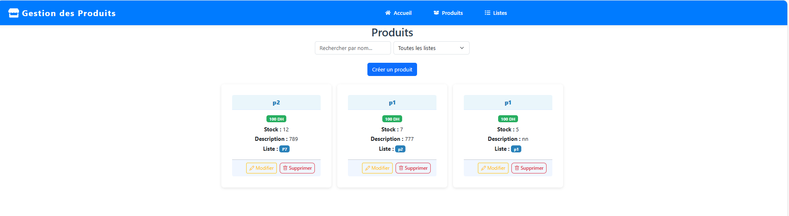

# Gestion des Produits

Ce projet est une application web pour la gestion de produits et de listes de produits. Il permet d'ajouter, modifier, supprimer et filtrer des produits, ainsi que de gérer des listes associées.

## Langages utilisés

-  **JavaScript (React)** : Interface utilisateur dynamique  
-  **C# (ASP.NET Core)** : Backend et API  
-  **HTML/CSS** : Structure et style des pages  
-  **JSON** : Configuration et échanges

## Structure du projet

```
Web/
│
├── Domain/           # Modèles de données (C#)
├── Repository/       # Accès aux données (C#)
├── Service/          # Logique métier (C#)
├── Web/              # Projet principal ASP.NET Core
│   ├── wwwroot/      # Fichiers statiques (images, CSS, JS)
│   └── views/        # Frontend React
│       ├── src/      # Sources React (App.js, composants, etc.)
│       └── public/   # Fichiers publics React
└── Web.sln           # Fichier solution Visual Studio
```

## Fonctionnalités

- Ajout, modification et suppression de produits
- Upload d'image pour chaque produit
- Gestion des listes de produits
- Filtrage et recherche avancée
- Interface moderne avec React et ASP.NET Core

## Aperçu

### Page d'accueil


### Liste des produits



### Gestion des listes


## Installation

1. Cloner le dépôt :
   ```bash
   git clone <url-du-repo>
   ```
2. Installer les dépendances React :
   ```bash
   cd Web/views
   npm install
   ```
3. Lancer le backend ASP.NET Core :
   ```bash
   cd ../..
   dotnet run --project Web/Web.csproj
   ```
4. Lancer le frontend React :
   ```bash
   cd Web/views
   npm start
   ```

## Auteur

Sallaheddine

---

> Pour toute question, consulte la documentation ou ouvre
